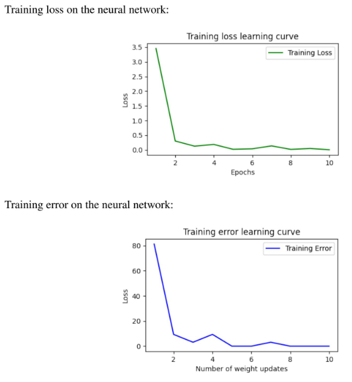
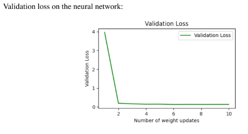
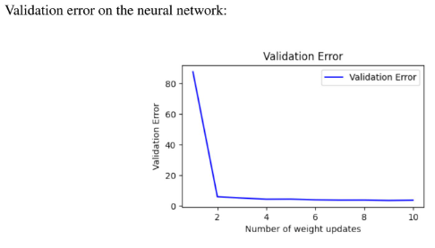
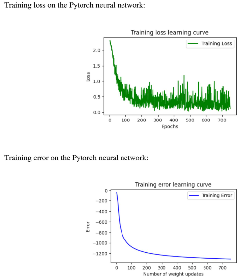
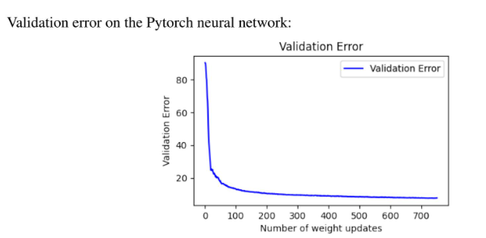

# Neural-Network-From-Scratch-in-Numpy
This shows my implementation of a Neural Network from scratch written majorly using the numpy library. The backward propagation is written by taking the derivative, instead of calling a backward function of pytorch, keras, tensorflow or similar libraries. The softmax cross entropy loss is also designed with its forward and backward propagation functions. The neural network is trained on MNIST dataset and its accuracy for digit recognition is calculated.

Another neural network is implemented in Pytorch and its performance is compared to that of the neural network written in scratch.

